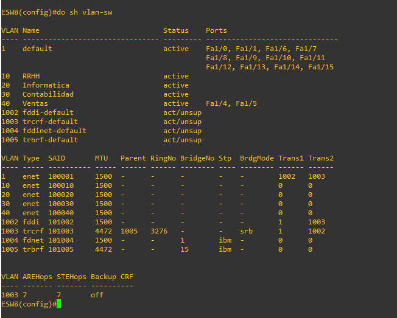

# Proyecto 1 :triangular_flag_on_post:
### Integrantes
Carne | Nombre |
|-----|-----|
|201902714 | Kevin Josué Calderón Peraza | 
|201901016 | Kevin Alfredo López Rodríguez |
|201902308 | Samuel Isaac Pérez Pérez |
|201213487| Vania Argueta Rodríguez |

## Requerimientos GNS3
* Versión: **2.2.10**
* Sistema operativo: **Windows 10 u 11**
* Imagenes IOS: **Imagen de Ethernetswitch (Switch de Capa 3)** (porporcionada por el tutor)
* VirtualBox: **Imagen ISO, Ubuntu 20.04**

## TOPOLOGIA 1 :boom:


### ESW1

#### VTP
```
config term
vtp mode client
vtp domain GRUPO5
vtp password grupo5
vtp version 2
```


#### INTERFACES
```
int range f1/4 - 5
switchport mode trunk
switchport trunk allowed vlan 1,1002-1005,10,20,30,40

int f1/1
switchport mode access
switchport access vlan 10

int f1/2
switchport mode access
switchport access vlan 30

int f1/3
switchport mode access
switchport access vlan 10
```
#### VLANS


### ESW2
#### VTP
```
conf t
vtp mode client
vtp domain GRUPO5
vtp password grupo5
vtp version 2
```


#### INTERFACES
```
int range f1/1 - 3
switchport mode trunk
switchport trunk allowed vlan 1,1002-1005,10,20,30,40
```
#### VLANS


### ESW3

#### VTP
```
conf t
vtp mode client
vtp domain GRUPO5
vtp password grupo5
vtp version 2
```


#### INTERFACES
```
int range f1/1 - 3
switchport mode trunk
switchport trunk allowed vlan 1,1002-1005,10,20,30,40

ESW3
int f1/1
switchport mode trunk
switchport trunk allowed vlan 1,1002-1005,10,20,30,40 

int f1/2
switchport mode trunk
switchport trunk allowed vlan 1,1002-1005,10,20,30,40 

int f1/5
switchport mode access
switchport access vlan 30

int f1/4 
switchport mode access
switchport access vlan 40

int f1/3
switchport mode access
switchport access vlan 20
```

#### VLANS


### DIRECCIONAMIENTO DE HOST/VPCS

```

RRHH_1 > ip 192.168.51.10 255.255.255.0 192.168.51.1
Conta_1 > ip 192.168.53.10 255.255.255.0 192.168.53.1
RRHH_2  > ip 192.168.51.20 255.255.255.0 192.168.51.1
Conta_2 > ip 192.168.53.20 255.255.255.0 192.168.53.1
Venta_1 > ip 192.168.54.10 255.255.255.0 192.168.54.1
Informatica_1 > ip 192.168.52.10 255.255.255.0 192.168.52.10

```


## TOPOLOGIA 2 :boom:


### ESW4

#### VTP
```
vtp mode server
vtp domain GRUPO5
vtp password grupo5
vtp version 2

```


#### INTERFACES

```
int range f1/1 - 3
switchport mode trunk
switchport trunk allowed vlan 1,1002-1005,10,20,30,40
```

#### CONFIGURACION DE ROOT BRIGDE PARA VLANS

```
spanning-tree vlan 1 root primary
spanning-tree vlan 10 root primary
spanning-tree vlan 20 root primary
spanning-tree vlan 30 root primary
spanning-tree vlan 40 root primary
```

#### VLANS

```
vlan 10
name RRHH
exit
vlan 20
name Informatica
exit
vlan 30
name Contabilidad
exit
vlan 40 
name Ventas

do sh vlan-sw   
```


### ESW5

#### VTP

```
vtp mode client
vtp domain GRUPO5
vtp password grupo5
vtp version 2

```


#### INTERFACES

```
int range f1/1 - 2
switchport mode trunk
switchport trunk allowed vlan 1,1002-1005,10,20,30,40
```

#### VLANS


### ESW6

#### VTP

```
vtp mode client
vtp domain GRUPO5
vtp password grupo5
vtp version 2

```


#### INTERFACES

```
int range f1/1 - 4
switchport mode trunk
switchport trunk allowed vlan 1,1002-1005,10,20,30,40
```

#### VLANS


### ESW7

#### VTP

```
vtp mode client
vtp domain GRUPO5
vtp password grupo5
vtp version 2

```


#### INTERFACES

```
int range f1/1 - 2 
switchport mode trunk
switchport trunk allowed vlan 1,1002-1005,10,20,30,40

int f1/4
switchport mode trunk
switchport trunk allowed vlan 1,1002-1005,10,20,30,40

int f1/3
switchport mode access
switchport access vlan 20

```


#### VLANS


#### DIRECCIONAMIENTO DE HOST/VPS

```
Informatica_2 > 192.168.52.20 255.255.255.0 192.168.52.1
```

#### CONFIGURACIÓN DE CLOUDS


## TOPOLOGIA 3 :boom:


#### ESW8

#### VTP

```
vtp mode client
vtp domain GRUPO5
vtp password grupo5
vtp version 2
```


#### INTERFACES

```
int range f1/1 - 2 
switchport mode trunk
switchport trunk allowed vlan 1,1002-1005,10,20,30,40

int f1/3
switchport mode trunk
switchport trunk allowed vlan 1,1002-1005,10,20,30,40

int f1/4
switchport mode access
switchport access vlan 40

int f1/5
switchport mode access
switchport access vlan 40
```

#### VLANS




#### ESW9

#### VTP

```
vtp mode client
vtp domain GRUPO5
vtp password grupo5
vtp version 2
```


#### INTERFACES

```
int f1/2 
switchport mode trunk
switchport trunk allowed vlan 1,1002-1005,10,20,30,40

int f1/5 
switchport mode trunk
switchport trunk allowed vlan 1,1002-1005,10,20,30,40

int f1/3 
switchport mode trunk
switchport trunk allowed vlan 1,1002-1005,10,20,30,40

int f1/1
switchport mode access
switchport access vlan 30

int f1/4
switchport mode access
switchport access vlan 30
```


#### VLANS


#### ESW10

#### VTP

```
vtp mode client
vtp domain GRUPO5
vtp password grupo5
vtp version 2
```


#### INTERFACES

```
int f1/1 
switchport mode trunk
switchport trunk allowed vlan 1,1002-1005,10,20,30,40

int f1/3
switchport mode trunk
switchport trunk allowed vlan 1,1002-1005,10,20,30,40

int f1/4
switchport mode access
switchport access vlan 10

int f1/2
switchport mode access
switchport access vlan 10
```

#### VLANS


#### ESW11

#### VTP

```
vtp mode transparent
vtp domain GRUPO5
vtp password grupo5
vtp version 2

```


#### INTERFACES

```
int range f1/2 - 3
switchport mode trunk
switchport trunk allowed vlan 1,1002-1005,10,20,30,40

int f1/1
switchport mode access
switchport access vlan 20

```

#### VLANS


#### DIRECCIONAMIENTO DE HOST/VPS

```
Server_conta > ip 192.168.53.30 255.255.255.0 192.168.53.1
Conta_4 > ip 192.168.53.40 255.255.255.0 192.168.53.1
RRHH_3 > ip 192.168.51.30 255.255.255.0 192.168.51.1
Server_RRHH > ip 192.168.51.40 255.255.255.0 192.168.51.1
Server_ventas > ip 192.168.54.20 255.255.255.0 192.168.54.1
Venta_3 > ip 192.168.54.30 255.255.255.0 192.168.54.1
Server_informatica > ip 192.168.52.30 255.255.255.0 192.168.52.1
````

#### PRUEBAS DE PING A SERVIDORES DE CONTABILIDAD Y RRHH DESDE UNA VPC


