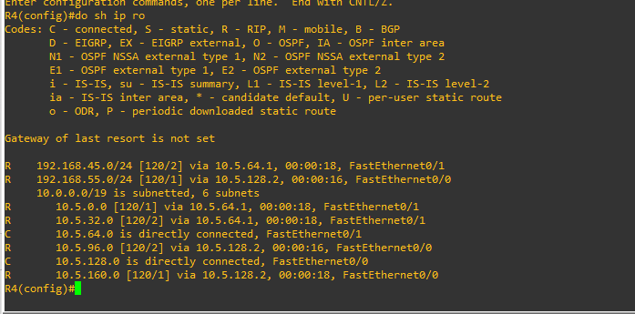

# Proyecto 2 :triangular_flag_on_post:
### Integrantes
Carne | Nombre |
|-----|-----|
|201902714 | Kevin Josué Calderón Peraza | 
|201901016 | Kevin Alfredo López Rodríguez |
|201902308 | Samuel Isaac Pérez Pérez |
|201213487| Vania Argueta Rodríguez |

## Requerimientos GNS3
* Versión: **2.2.10**
* Sistema operativo: **Windows 10 u 11**
* Imagenes IOS: **Imagen de Ethernetswitch (Switch de Capa 3)** (porporcionada por el tutor)
* VirtualBox: **Imagen ISO, Ubuntu 20.04**

## TOPOLOGIA 1 :boom:


### Direcciones IP - FLSM

Subred | Network | Mascara de subred | P Asignable | U Asignable | Broadcast | Cantidad de host |
|-----|-----|-----|-----|-----|-----|-----|
| Subred 1 | 10.5.0.0 | 255.255.224.0 | 10.5.0.1 | 10.5.31.254 | 10.5.31.255 |  8190 | 
| Subred 2 | 10.5.32.0 | 255.255.224.0 | 10.5.32.1 |	10.5.63.254	| 10.5.63.255 | 8190 |
| Subred 3 | 10.5.64.0 | 255.255.224.0 | 10.5.64.1 | 10.5.95.254	| 10.5.95.255 | 8190 |
| Subred 4 | 10.5.96.0 | 255.255.224.0 | 10.5.96.1 |	10.5.127.254 |	10.5.127.255 | 8190 |
| Subred 5 | 10.5.128.0 | 255.255.224.0 | 10.5.128.1 |10.5.159.254 |	10.5.159.255 | 8190 |
| Subred 6 | 10.5.160.0 | 255.255.224.0 | 10.5.160.1 |	10.5.191.254 |	10.5.191.255 | 8190 |

### R2

```
int f0/0
ip address 10.5.0.1 255.255.224.0
duplex full 
shutdown
no shutdown
exit

int f0/1
ip address 10.5.64.1 255.255.224.0
duplex full 
shutdown
no shutdown

router rip
version 2
network 10.5.0.0
network 10.5.64.0
exit
```


### R3

```
int f0/0
ip address 10.5.32.1 255.255.224.0
duplex full 
shutdown
no shutdown
exit

int f0/1
ip address 10.5.96.1 255.255.224.0
duplex full 
shutdown
no shutdown
exit

router rip
version 2
network 10.5.32.0
network 10.5.96.0

```


### R4

```
int f0/1
ip address 10.5.64.2 255.255.224.0
duplex full 
shutdown
no shutdown
exit

int f0/0
ip address 10.5.128.1 255.255.224.0
duplex full 
shutdown
no shutdown
exit


router rip
version 2
network 10.5.64.0
network 10.5.128.0
exit
```



### R5

```
int f0/1
ip address 10.5.96.2 255.255.224.0
duplex full 
shutdown
no shutdown
exit

int f0/0
ip address 10.5.160.1 255.255.224.0
duplex full 
shutdown
no shutdown
exit


router rip
version 2
network 10.5.96.0
network 10.5.160.0
exit
```


### Configuraciones de la Nubes


## TOPOLOGIA 2 :boom:


### Direcciones IP - VLSM

VLAN | Network | Mascara de subred | P Asignable | U Asignable | Broadcast | Cantidad de host |
|-----|-----|-----|-----|-----|-----|-----|
| 10 | 192.168.45.192 | 255.255.255.224 | 192.168.45.193 | 192.168.45.222 | 192.168.45.223 | 30   | 
| 20 | 192.168.45.224 | 255.255.255.240  | 192.168.45.225  |	192.168.45.238	| 192.168.45.239 | 14  |
| 30 | 192.168.45.0 | 255.255.255.128 | 192.168.45.1 | 192.168.45.126 | 192.168.45.127 | 126  |
| 40 | 192.168.45.128 | 255.255.255.192  | 192.168.45.129 | 192.168.45.190 | 192.168.45.191	| 62  |

### R1

```
int f0/0
ip address 10.5.0.2 255.255.224.0
duplex full 
shutdown
no shutdown
exit

int f1/0
ip address 10.5.32.2 255.255.224.0
duplex full 
shutdown
no shutdown
exit

int f0/1
ip address 192.168.45.1 255.255.255.0
duplex full 
shutdown
no shutdown
exit

router rip
version 2
network 192.168.45.0
network 10.5.0.0
network 10.5.32.0
exit
```


### ESW4

```
vlan 10
name RHUMANOS
exit

vlan 20
name CONTABILIDAD
exit

vlan 30
name VENTAS
exit

vlan 40
name INFORMATICA
exit


vtp domain redes1gp5
vtp password redes1gp5
vtp mode server
vtp version 2
exit

int range f1/1 - 2
channel-group 1 mode on
int port-channel 1
switchport mode trunk
switchport trunk allowed vlan 1,10,20,30,40,1002-1005
exit

int range f1/3 - 4
channel-group 2 mode on
int port-channel 2 
switchport mode trunk
switchport trunk allowed vlan 1,10,20,30,40,1002-1005
exit


int f1/0
switchport mode trunk
switchport trunk allowed vlan 1,10,20,30,40,1002-1005
exit


spanning-tree vlan 1 root primary
spanning-tree vlan 10 root primary
spanning-tree vlan 20 root primary
spanning-tree vlan 30 root primary
spanning-tree vlan 40 root primary
```


### ESW3

```
vtp domain redes1gp5
vtp password redes1gp5
vtp mode client
vtp version 2
exit


int range f1/0 - 1
channel-group 1 mode on
int port-channel 1
switchport mode trunk
switchport trunk allowed vlan 1,10,20,30,40,1002-1005
exit


int range f1/2 - 4
channel-group 3 mode on
int port-channel 3
switchport mode trunk
switchport trunk allowed vlan 1,10,20,30,40,1002-1005
exit

int range f1/5 - 6
channel-group 4 mode on
int port-channel 4
switchport mode trunk
switchport trunk allowed vlan 1,10,20,30,40,1002-1005
exit

int range f1/8 - 9
channel-group 2 mode on
int port-channel 2
switchport mode trunk
switchport trunk allowed vlan 1,10,20,30,40,1002-1005
exit
```


### ESW1 

```
vtp domain redes1gp5
vtp password redes1gp5
vtp mode client
vtp version 2
exit


int range f1/1 - 2
channel-group 4 mode on
int port-channel 4
switchport mode trunk
switchport trunk allowed vlan 1,10,20,30,40,1002-1005
exit

int range f1/6 - 7
channel-group 6 mode on
int port-channel 6
switchport mode trunk
switchport trunk allowed vlan 1,10,20,30,40,1002-1005
exit

int range f1/3 - 4 
channel-group 5 mode on
int port-channel 5
switchport mode trunk
switchport trunk allowed vlan 1,10,20,30,40,1002-1005
exit

int range f1/10 - 11
channel-group 3 mode on
int port-channel 3
switchport mode trunk
switchport trunk allowed vlan 1,10,20,30,40,1002-1005
exit

int range f1/8 - 9
channel-group 1 mode on
int port-channel 1
switchport mode trunk
switchport trunk allowed vlan 1,10,20,30,40,1002-1005
exit
```


### ESW2

```
vtp domain redes1gp5
vtp password redes1gp5
vtp mode client
vtp version 2
exit


int range f1/0 - 1
channel-group 2 mode on
int port-channel 2
switchport mode trunk
switchport trunk allowed vlan 1,10,20,30,40,1002-1005
exit

int range f1/2 - 4
channel-group 3 mode on
int port-channel 3
switchport mode trunk
switchport trunk allowed vlan 1,10,20,30,40,1002-1005
exit

int range f1/5 - 6 
channel-group 5 mode on
int port-channel 5
switchport mode trunk
switchport trunk allowed vlan 1,10,20,30,40,1002-1005
exit

int range f1/7 - 8
channel-group 1 mode on
int port-channel 1
switchport mode trunk
switchport trunk allowed vlan 1,10,20,30,40,1002-1005
exit

```


### IP DE LAS VPCS

```
--CONTABILIDAD1
ip 192.168.45.226 255.255.255.240 192.168.45.225

--INFORMATICA1
ip 192.168.45.130 255.255.255.192 192.168.45.129
--INFORMATICA2
ip 192.168.45.131 255.255.255.192 192.168.45.129

--VENTAS1
ip 192.168.45.2 255.255.255.128 192.168.45.1
--VENTAS2
ip 192.168.45.3 255.255.255.128 192.168.45.1

--RRHH1
ip 192.168.45.194 255.255.255.224 192.168.45.193
--RRHH2
ip 192.168.45.195 255.255.255.224 192.168.45.193

```


## TOPOLOGIA 3 :boom:


### Direcciones IP - VLSM

VLAN | Network | Mascara de subred | P Asignable | U Asignable | Broadcast | Cantidad de host |
|-----|-----|-----|-----|-----|-----|-----|
| 10 | 192.168.55.192 | 255.255.255.224 | 192.168.55.193 | 192.168.55.222 | 192.168.55.223 | 30   | 
| 20 | 192.168.55.224 | 255.255.255.240 | 192.168.55.225 |	192.168.55.238 | 192.168.55.239 | 14 |
| 30 | 192.168.55.0 | 255.255.255.128 | 192.168.55.1 | 192.168.55.126 | 192.168.55.127 | 126 |
| 40 | 192.168.55.128 | 255.255.255.192 | 192.168.55.129 | 192.168.55.190 | 192.168.55.191 | 62  |

### ESW8
```
vlan 10
name RHUMANOS
exit

vlan 20
name CONTABILIDAD
exit

vlan 30
name VENTAS
exit

vlan 40
name INFORMATICA
exit

vtp domain redes1gp5
vtp password redes1gp5
vtp mode server
vtp version 2

int f1/0
switchport mode trunk
switchport trunk allowed vlan 1,10,20,30,40,1002-1005

int f1/1
switchport mode access
switchport access vlan 30

int f1/2
switchport mode access
switchport access vlan 40

int f1/3
switchport mode access
switchport access vlan 10

int f1/4
switchport mode access
switchport access vlan 20
```


### R6
```
int f1/0
no shutdown

int f1/0.10
encapsulation dot1Q 10
ip address 192.168.55.193 255.255.255.224


int f1/0.20
encapsulation dot1Q 20
ip address 192.168.55.225 255.255.255.240

int f1/0.30
encapsulation dot1Q 30
ip address 192.168.55.1 255.255.255.128


int f1/0.40
encapsulation dot1Q 40
ip address 192.168.55.129 255.255.255.192


int f0/0
ip address 10.5.128.2 255.255.224.0
duplex full 
shutdown
no shutdown


int f0/1
ip address 10.5.160.2 255.255.224.0
duplex full 
shutdown
no shutdown


router rip
version 2
network 10.5.128.0
network 10.5.160.0
network 192.168.55.0
```


### Direcciones IP VPCS
```
--PC7
ip 192.168.55.2 255.255.255.128 192.168.55.1

--PC8
ip 192.168.55.130 255.255.255.192 192.168.55.129

--PC9
ip 192.168.55.194 255.255.255.224 192.168.55.193

--PC10
ip 192.168.55.226 255.255.255.240 192.168.55.225

```

