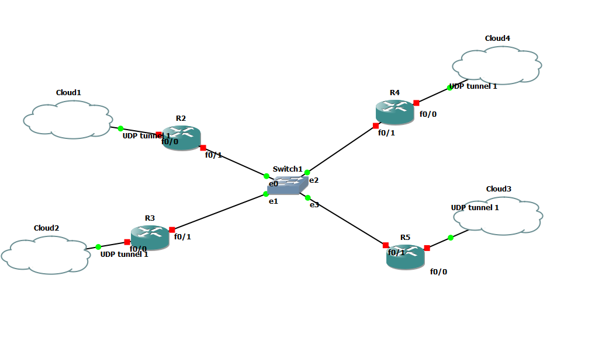

# Proyecto 2 :triangular_flag_on_post:
### Integrantes
Carne | Nombre |
|-----|-----|
|201902714 | Kevin Josué Calderón Peraza | 
|201901016 | Kevin Alfredo López Rodríguez |
|201902308 | Samuel Isaac Pérez Pérez |
|201213487| Vania Argueta Rodríguez |

## Requerimientos GNS3
* Versión: **2.2.10**
* Sistema operativo: **Windows 10 u 11**
* Imagenes IOS: **Imagen de Ethernetswitch (Switch de Capa 3)** (porporcionada por el tutor)
* VirtualBox: **Imagen ISO, Ubuntu 20.04**

## TOPOLOGIA 1 :boom:

## TOPOLOGIA 2 :boom:

## TOPOLOGIA 3 :boom:

